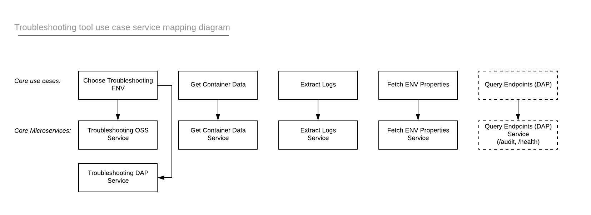

# Conjur Troubleshooting Tool

## Proposal

Troubleshooting can be a time-consuming undertaking as a developer works with different development and deployment environments, platforms, and tooling that finding the source of the problem is rarely ever clear. To tackle this ongoing issue, we need an effective tool (with a great UI) that will aid in the troubleshooting process.

## Goal

Provide value to the team while also expanding knowledge and experience on a variety of topics REST/curl, Models, Design Patterns, Angular.

## Ideas:

- A tool that fetch specific logs according to specific errors/keywords from Conjur in a containerized env and grabs the ENV variables from policy and container ENV. Ex: user input: "authentication" will return all log entries with "Authentication"

- Sales force tool that extracts all useful information from cases necessary for engineers to troubleshoot the case

- Page with mappings of repository names to their pull commands. Ex: `conjur` → `docker pull registry2.itci.conjur.net/conjur` (for both private and public registries)

- Slackbot where if you use a certain #tag (#documentation), will create salesforce cases for documentation  

# Phase 0
- [x] Reach out to developers, PO/Ms, and SEs to understand the pain points and use this feedback to develop tooling that will feature in the project

- [x] Define an MVP that will provide immediate value and a running backlog

- [x] Create the design and map out call chains and possible user interactions

For the first iteration of this tool, I have decided to pursue the first idea and create a tool that will do the following:

- Connect with Conjur OSS containers and extract ENV variables

- Parse and extract Conjur logs based on the type user requests

- A .txt file will be returned to the user with the ENV variables listed at the top and all associated log entries

## Design

The following defines the sequence diagram for this project.   

The following represnts the use case diagram for this project.

### Open questions:

- I provided the Use Case Diagram above but do not feel that those (`Get Container Data` and `Extract Logs/Env`) are use cases as these items depend on Troubleshooting to operate correctly. Are there more use cases besides troubleshooting? 

- In the Troubleshooting class should I use a factory method that chooses between 2 different classes (DAP/Conjur) that implements the same interface (ConjurEnv)?

- What language to write this project in?