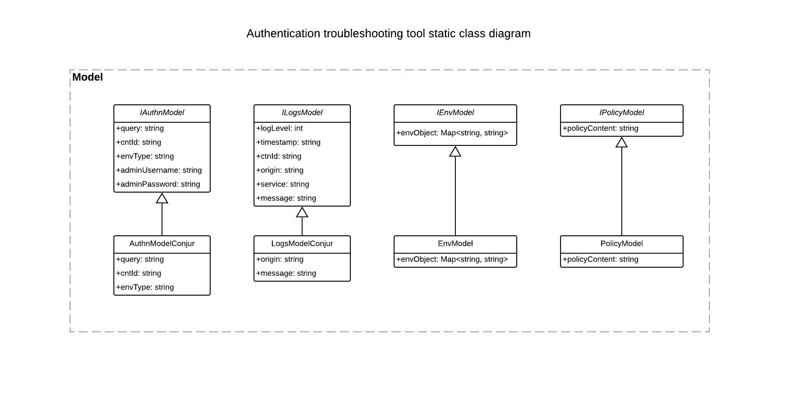
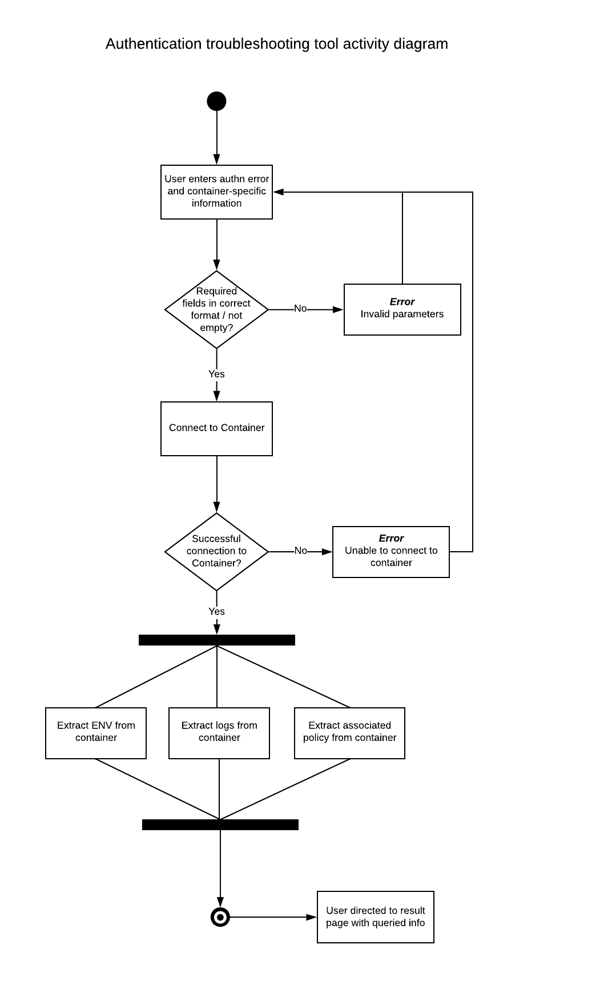

# Conjur Authentication Troubleshooting Tool

## Proposal

Troubleshooting authentication errors can be a time-consuming undertaking as a developer works with different development 
and deployment environments, platforms, and tooling that understanding a cryptic 401 Unauthorized error is near to impossible. 
To tackle this ongoing issue, we need an effective tool (with a great UI) that will aid in the troubleshooting process.

## Goal

Provide value to the team while also expanding knowledge and experience on a variety of topics REST/curl, MVC, Design 
Patterns, Docker, Angular.

## Ideas:

- A tool that fetches specific logs according to defined authentication errors/keywords from Conjur in a containerized 
environment, container ENV variables, and all related information about the unauthenticated user (if the user exists in 
Conjur, the Conjur policy where the user is defined, their privileges, etc).
    
    - For DAP, checks API Endpoints are functioning correctly by making queries to health, nginx services, etc _(out of scope)_
    
    - For DAP, fetch Master/Follower logs and configurations  _(out of scope)_
 
- Salesforce tool that extracts all useful information from cases necessary for engineers to troubleshoot the case

- Page with mappings of repository names to their pull commands. Ex: `conjur` → `docker pull registry2.itci.conjur.net/conjur` (for both private and public registries)

- Slackbot where if you use a certain #tag (#documentation), will create salesforce cases for documentation  

## MVP

For the first iteration of this tool, I have decided to pursue the first idea and create a tool that will do the following:

- Connect with Conjur / DAP containers

- Extract ENV variables

    - *NOTE:* By default, the tool also supports DAP b/c from the functionality currently offered, the user can input 
    the container name/id and receive the necessary logs and ENV variables which is environment agnostic
    
    - *NOTE:* For OSS, we are limited to setting the log levels as container ENV variables before OSS spin up

- Parse and extract Conjur / DAP logs based on the type user requests

- Return the user's relevant data in Conjur (if the user exists in Conjur, the Conjur policy where the user is defined, 
their privileges, etc).

- Return a result page with data

## Phase 0

- [x] Reach out to developers, PO/Ms, and SEs to understand the pain points and use this feedback to develop tooling that will feature in the project

- [x] Define an MVP that will provide immediate value and a running backlog

- [x] Create the design

## Design

Class diagram:

Sequence diagram:

Activity diagram:

UI Mocks can be found here: https://www.figma.com/file/QcAxsC58Lh969NLunI8sTT/Authn2Mock?node-id=0%3A1

- App will save state so that the user does not have to redefine query with each session
 
### Open questions:

- What language to write this project in? 
    
    - Angular/Typescript, Node Docker API: https://www.npmjs.com/package/node-docker-api